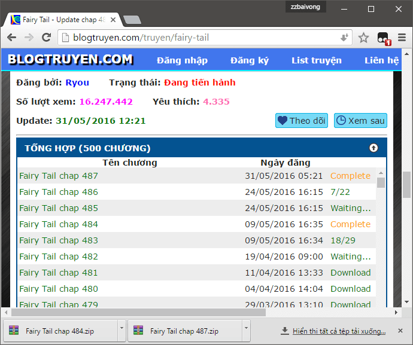
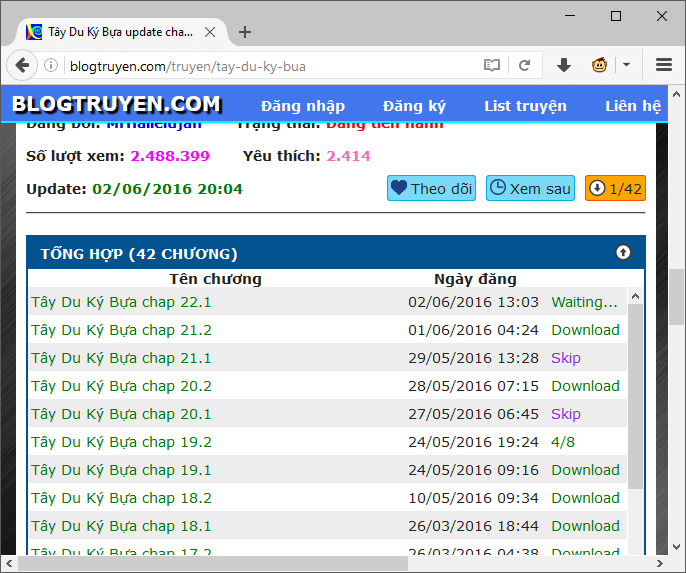

# Blogtruyen downloader

Userscript giúp tải truyện từ blogtruyen.com về máy với định dạng Zip theo từng Chap.

## Hướng dẫn sử dụng

Để tải riêng từng Chap, nhấn vào nút **Download** phía sau tên Chap đó trong danh sách, hoặc nút **Download** trong trang đọc truyện mỗi Chap.

Nhấn vào nút **Download all** để tải toàn bộ. Nếu muốn bỏ qua, không tải Chap nào thì nhấn **chuột phải** lên nút **Download** sau tên Chap đó.

Sau khi tải xuống, bạn nên dùng ứng dụng [Honeyview](https://www.bandisoft.com/honeyview/vn/) hoặc [Mcomix](https://sourceforge.net/projects/mcomix/) để đọc truyện mà không cần giải nén.

### Chú ý

Nếu bạn sử dụng tiện ích **Tampermonkey** để quản lý Userscript, ở một số Chap sẽ xuất hiện cửa sổ thông báo **A userscript wants to access a cross-origin resource**, yêu cầu xác minh quyền truy cập Domain. Bạn nhấn vào **Always allow all domains**.

Nguyên nhân là do Tampermonkey yêu cầu khai báo chi tiết Domain của Host sẽ truy cập. Mình đã liệt kê các Host chứa ảnh chính của Blogtruyen, bao gồm: *Blogspot, Imgur, Zdn, Postimg*. Chỉ truyện nào sử dụng Host khác mới hiện thông báo đó.
